# PCB Defect Detection — CNN + Kafka + MLOps

[](https://github.com/akshatyuvan/pcb-defect/actions/workflows/ci.yml)

A convolutional network trained from scratch to find copper-layer defects on bare PCBs,
served behind FastAPI, and fed by a Kafka stream that simulates a QC camera line.

The point of this repository is not that six technologies are wired together. It is that
every number below was **measured**, including the ones that came out worse than I expected.

**Sustained capacity is ~1.3 boards/s, and I can tell you which component sets it.**

---

## The short version

I shipped a serving stack on Day 5 that flagged 95 of 100 tiles on a real board. On Day 7 I
measured *why*: the board-level rule I was using — count of flagged tiles — scores an AUROC
of **0.5877** against defect-free boards. That is a coin flip. The patch-level threshold I
had reused (0.000416) sits below the model's characteristic output on ordinary copper
(~0.0171), so nearly every tile crossed it.

I swept nine candidate board statistics against the dataset's own defect-free reference
boards and chose on specificity at a fixed 99% defect recall. The winner, `top3_mean`,
scores **AUROC 0.9988**. Then on Day 8 I measured the new rule on boards from capture groups
it had never seen, and its false-alarm rate came in at **9.7% against the ~2% its own
calibration predicted** — a 5× miss with a specific, identifiable cause (below).

Ship, measure, find the number is bad, fix it with data, measure the fix, find its limit.
That loop is what this project is for.

---

## The task, and why it is framed this way

The dataset is [DeepPCB](https://github.com/tangsanli5201/DeepPCB): 1,500 binarised 640×640
board images, each paired with a defect-free template capture. Six defect classes, all in
the copper layer of a **bare** board — `open`, `short`, `mousebite`, `spur`, `copper`
(spurious copper), `pinhole`. No mounted components, so nothing here is about solder joints
or component placement.

DeepPCB ships as an **object-detection** dataset. Every annotated image has 3–12 defects and
there are **no defect-free test images**. A whole-image classifier on that data would be a
fake, perfectly balanced task that scores ~100% and means nothing.

So I derived a patch-level classification task from the boxes: each board is tiled into a
10×10 grid of 64×64 patches, a patch takes a defect label when an annotated box meets the
labelling rule, and a patch matching no box is `good`. Seven classes.

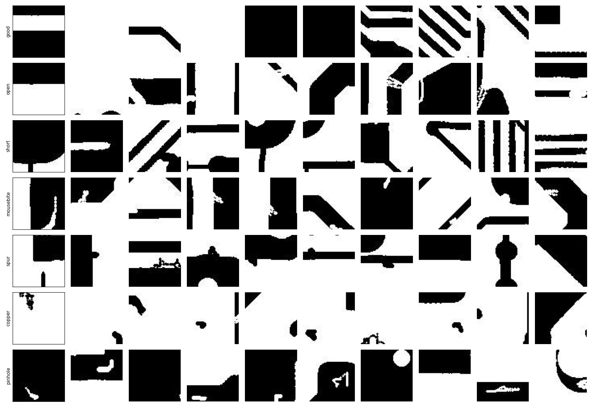

*Ten sampled patches per class, eyeballed on Day 1 to confirm the annotation-id → class-name
mapping before a single epoch was trained. Getting this wrong would have produced a model
that trains cleanly and reports confidently wrong per-class metrics.*

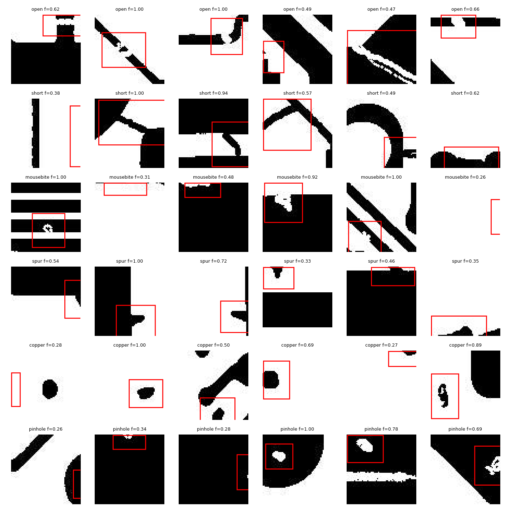

*The derivation itself: annotated boxes overlaid on the 64×64 tile grid. Boxes that straddle
a tile boundary are why the labelling rule needs a threshold rather than mere intersection,
and why 5.8% of candidate patches are dropped as ambiguous rather than guessed at.*

That derivation is where the real class imbalance comes from — **8.9:1**, with `good` at
71,941 of 80,048 training patches. Which is why accuracy is reported but never used to
select a model: **always-predict-good already scores 89.9% accuracy** (and 0.135 macro F1).

Splits are **by board, not by patch**. Patches from one board are correlated, so splitting
after tiling would leak between train and test.

---

## Architecture

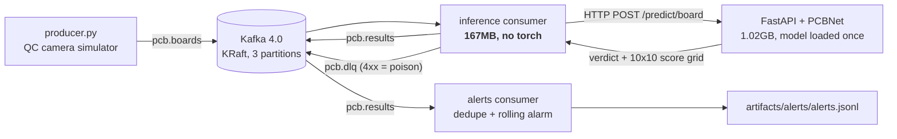

**The consumers never load the model.** They call the API over HTTP, so the 1.17M-parameter
network is loaded exactly once across the entire stack. This is enforced structurally, not
by convention: the consumer image is built from a separate Dockerfile whose requirements file
contains one line (`confluent-kafka`). It is **167MB against the API's 1.02GB**, and

```
$ docker compose exec inference python -c "import torch"
ModuleNotFoundError: No module named 'torch'
```

CI asserts the consumer requirements file contains no torch, so that property cannot erode.
On an 8GB laptop with 4.11GB allocated to Docker, this is a hard memory requirement, not a
stylistic preference.

---

## Results

### Is a neural network necessary?

I built the classical answer first — OpenCV template differencing against each board's paired
defect-free template — and measured it on the **identical** 47,342 test patches.

| | Average precision | Detection ceiling | Notes |
|---|---|---|---|
| **PCBNet (CNN, from scratch)** | **0.823** | — | 1,174,439 params |
| Template differencing (OpenCV) | 0.724 | 0.8161 | kernel=5, min_area=0 |

The baseline was tuned before it was compared, over a 12-point grid, selected on
**validation** AP with the test set untouched:

| kernel | min_area | val AP | ceiling | P@R=0.97 |
|---|---|---|---|---|
| 0 | 0 | 0.3621 | **0.9922** | 0.1809 |
| 0 | 25 | 0.3696 | 0.9725 | 0.2292 |
| 3 | 0 | 0.6086 | 0.9521 | 0.1007 |
| **5** | **0** | **0.8516** | 0.8605 | 0.1007 |
| 5 | 25 | 0.8201 | 0.8217 | 0.1007 |
| 7 | 0 | 0.6219 | 0.5800 | 0.1007 |

The tradeoff in that table is the interesting part. `kernel=0` reaches a **0.9922 detection
ceiling** — in principle it can find 99% of defects — but scores AP 0.3621, because without
morphological opening the residual alignment noise outranks the real defects. `kernel=5`
throws away a fifth of the reachable recall and more than doubles AP. Opening removes noise
and genuine small defects at similar rates, and AP says the trade is worth it anyway.

I selected on AP rather than on P@R=0.97 deliberately: at extreme recall the metric is
dominated by the tail and is very noisy, and six of the twelve grid points report an
identical 0.1007 — the degenerate value, not a real ranking signal.

Which is the same reason average precision is the honest headline comparison. The baseline's
"precision at 97% recall = 0.0939" figure is **degenerate and must be described as such**:
its detection ceiling of 0.8161 makes 97% recall structurally unreachable, so the number
comes from driving the threshold to 0.0, flagging every patch (4,447 TP against 42,895 FP),
and watching precision collapse to exactly the prevalence. All six of its per-class recalls
read 1.0000 for the same reason. Quoting that number as a win would be dishonest.

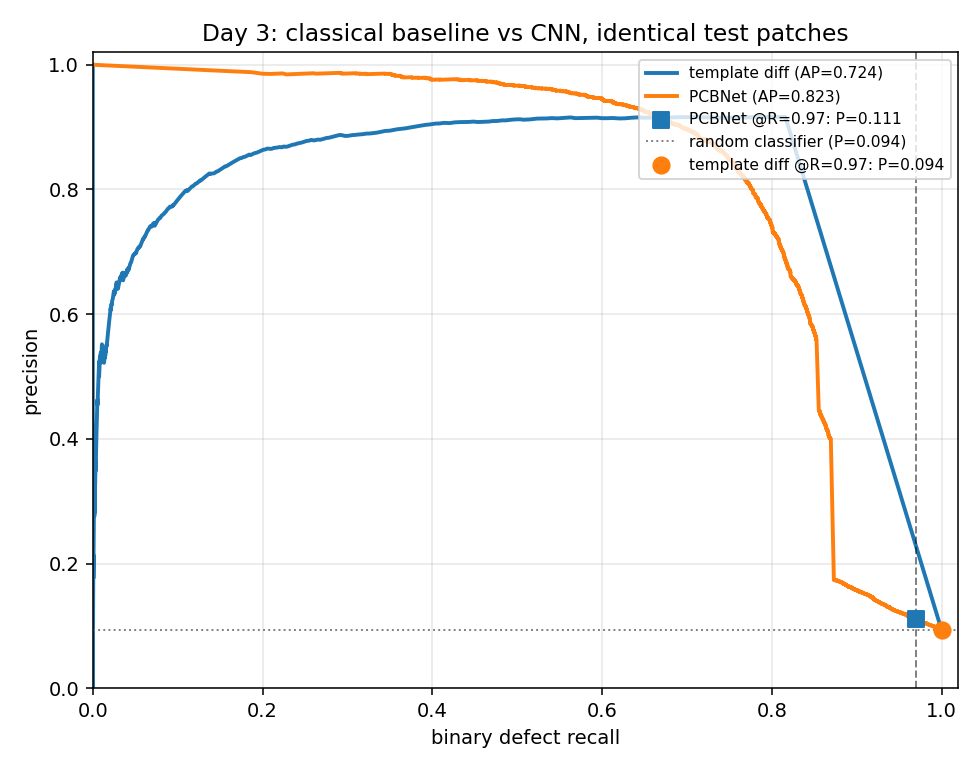

*Two things to read here. The baseline's curve **rises** with recall at the low end
(precision ~0.2 at recall 0, climbing to ~0.9 near recall 0.6) — its highest-scoring patches
are residual alignment error in dense trace regions, not its most confident defects. The long
straight descent is the tie-at-zero block. **Known cosmetic bug:** the legend marker colours
are crossed against the line colours. The curves and axes are correct; the underlying PR
arrays live on Colab and regenerating them for a legend was not worth a trip on the final
day.*

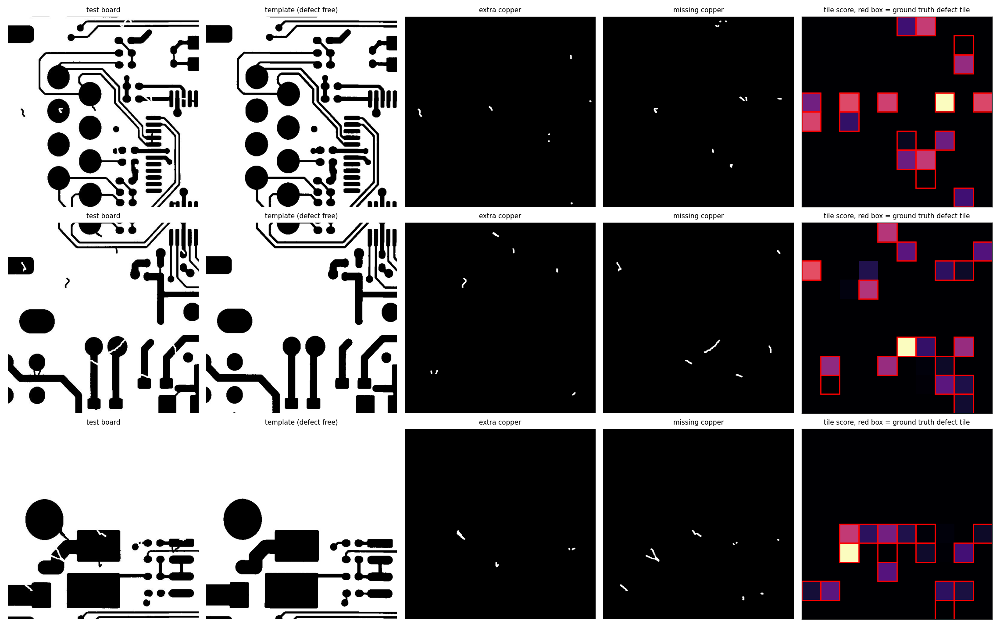

*Why the 0.8161 ceiling is a real property rather than a tuning failure: the polarity masks
are sparse isolated blobs, ~4–6 per sign per board, with no trace outlining — so the
alignment is working. Several red ground-truth boxes sit on black tile-score cells. Those are
the ~18% of defects that produce no difference signal at all, which no threshold can
recover.*

Where template differencing *does* win: it needs no training, and its polarity signal (is the
difference copper-where-substrate-should-be, or the reverse?) reaches **94.1% accuracy**
against a 50% chance baseline — a genuinely useful classical result, and near-perfect on
`open` (0.9904) and `pinhole` (0.9907).

### Training ablation

30 epochs, batch 256, AdamW, cosine schedule, AMP, seed 42, on a Colab T4 at 18–19 s/epoch.

| run | loss weight power | aug | best epoch | val macro F1 | test macro F1 | test acc | P @ R=0.97 |
|---|---|---|---|---|---|---|---|
| **r4_weighted_p05** (registered) | 0.5 | no | 29 | **0.7603** | 0.7172 | 0.9529 | 0.1106 |
| r1_unweighted | 0.0 | no | 10 | 0.7536 | 0.7186 | 0.9527 | 0.1775 |
| r2_weighted | 1.0 | no | 29 | 0.6975 | 0.6579 | 0.9287 | 0.1107 |
| r3_weighted_aug | 1.0 | yes | 12 | 0.6661 | 0.6451 | 0.9169 | 0.1849 |

The interesting result is that **full inverse-frequency weighting hurt**: precision fell
0.735 → 0.610 and good→short confusion went from 241 to 587 cases. More weighting is not
automatically better, which is why the weighting scheme is a swept hyperparameter here and
not a fixed choice.

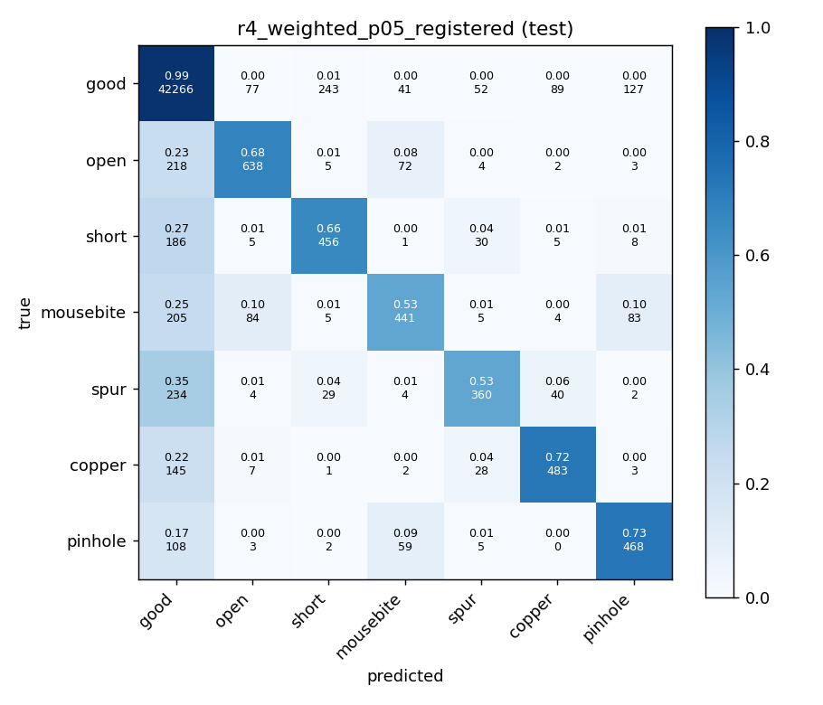

*Per-class test F1: good 0.980, open 0.725, copper 0.748, pinhole 0.699, short 0.637,
spur 0.622, **mousebite 0.610** (recall 0.533).*

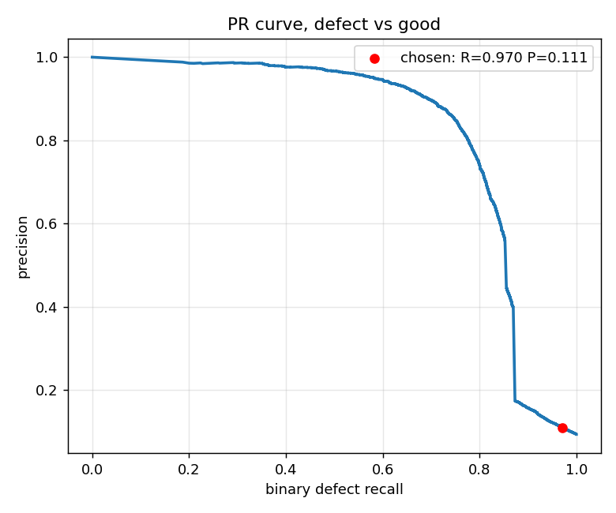

*Where the operating point came from. Precision falls off a cliff between recall 0.86 and
0.88 — roughly 0.42 down to 0.17 — so the 0.97 recall target sits well past the knee and
costs precision accordingly. Picking the target before looking at this curve is what makes
0.1106 a reported cost rather than a tuned number.*

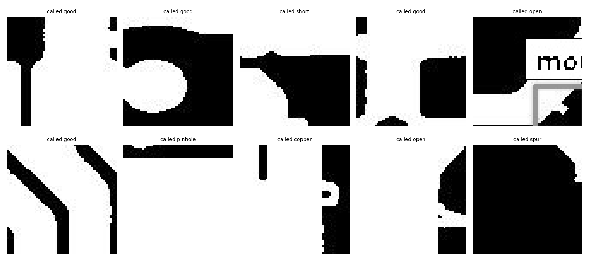

*Mousebite failures, inspected rather than assumed. **Mousebite is also the classical
baseline's worst class** (ceiling 0.6929). Two unrelated methods failing hardest on the same
class is evidence of intrinsic difficulty at 64×64 resolution, not a training failure.*

### Choosing the board-level operating point

The board verdict is not "did any patch cross the patch threshold." I swept nine candidate
statistics over 150 defective boards and 150 defect-free templates, and selected on
specificity at recall ≥ 0.99.

| statistic | AUROC | spec @ R≥.99 |
|---|---|---|
| **top3_mean** (selected) | **0.9988** | 0.9800 |
| top5_mean | 0.9960 | 0.9667 |
| mean_score | 0.9900 | 0.9600 |
| count_gt_0.5 | 0.9892 | 0.8933 |
| max_defect_score | 0.9847 | 0.9400 |
| count_gt_0.0171 | 0.5738 | 0.0400 |
| **n_flagged** (my original guess) | **0.5877** | 0.0267 |

`n_flagged` quantifies the Day 5 failure exactly. `count_gt_0.0171` scoring 0.5738 shows that
counting tiles above the copper floor is *also* uninformative — templates contain copper too.

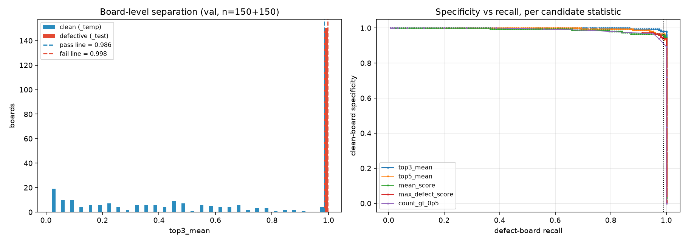

Selected thresholds: **pass < 0.985983, fail ≥ 0.997958**, giving three outcomes
(pass / route-to-human / fail) and a 1.7% review rate on the calibration set. The two
thresholds sit in a 0.0012-wide band near saturation, because the model's top-3 tiles pin
near 1.0 on defective boards. Real separation, but a sensitive operating point.

The statistic is defined in exactly **one module**, `src/streaming/board_stats.py`, imported
by both the calibrator and the consumer — because a calibration/inference mismatch cannot
raise. It would just route wrongly, forever, while the pipeline reported zero lag and looked
healthy. That module has nine dedicated tests for this reason.

### Do the heatmaps mean anything?

On PCBNet's Global-Average-Pooling + single-Linear head, Grad-CAM reduces **exactly** to CAM
(Zhou et al., 2016). I derived that and verified it numerically:

```
max |grad_weight - W/(H*W)| = 0.000e+00
```

That is why the head is GAP and not Flatten-into-a-dense-layer. A passing check proves the
hook and gradient path are correct, rather than proving a heatmap looks plausible. (The
*weights* match to zero; the resulting maps differ by 4–5e-07, which is float32
reduction-order noise. Both numbers are pinned in the test suite.)

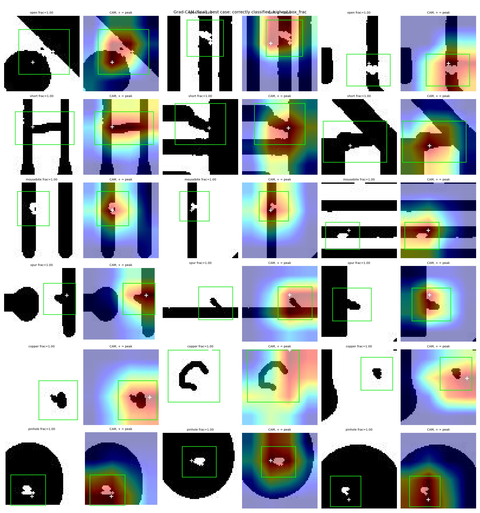

Evaluated as a **pointing game** against ground-truth boxes (n=4,447):

| layer | resolution | all classes | mousebite | copper | degenerate CAMs |
|---|---|---|---|---|---|
| final | 4×4 (16× upsample) | **0.8039** | 0.7666 | 0.8206 | 2.7% |
| features.2 | 8×8 | 0.6782 | 0.2285 | 0.9312 | 7.5% |
| random baseline | — | 0.2209 | | | |
| centre baseline | — | 0.2552 | | | |

Restricted to correctly-classified patches, the final layer reaches **0.9357**.

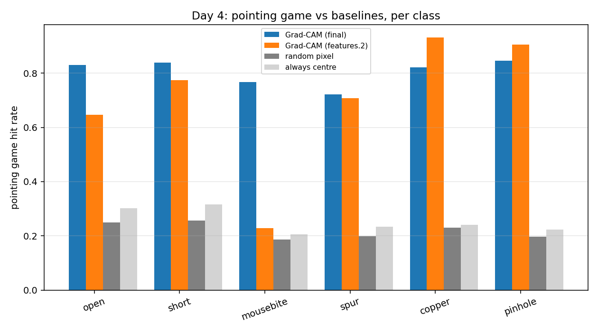

The counterintuitive part: the **lower-resolution** layer localises better overall, and
mousebite collapses to near-chance at 8×8 while copper improves.

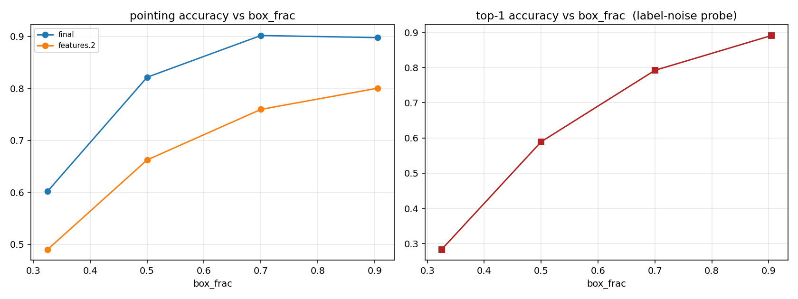

*Pointing accuracy climbs monotonically with box size (0.60 at box_frac ∈ [0.25, 0.40) → 0.90
at [0.80, 1.01)), and top-1 accuracy tracks it. That is label-noise evidence as much as model
evidence: small boxes are both harder to point at and harder to have labelled consistently.*

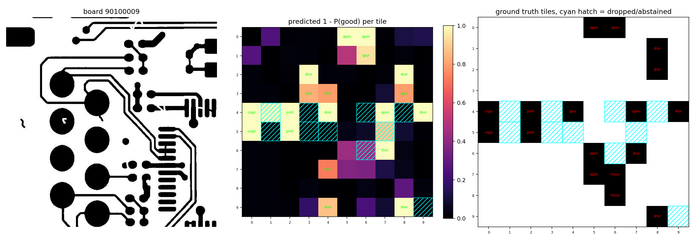

*Patch heatmaps stitched back into a full board. Note the board id: `90100` is one of the four
capture groups that appear **only** in the test split, so this is the model explaining a board
from a group it never trained on.*

One genuine negative result, reported because it is one: distance-to-edge showed no clean
separation between classes (3.7–6.8 across the board). It did not work and I am not burying
it. The mechanism that *did* separate mousebite from pinhole was copper fraction at the CAM
peak (0.55 vs 0.79).

### System characterisation

200 mixed boards per run (100 defective, 100 templates), producer unthrottled at ~71 boards/s.

| consumers | active | boards/s | e2e p50 (ms) | e2e p95 (ms) | api p50 (ms) | api p95 (ms) |
|---|---|---|---|---|---|---|
| 1 | 1 | 1.29 | 82,798 | 149,554 | 722 | 1,091 |
| 3 | 3 | 1.17 | 109,005 | 168,975 | 2,547 | 4,534 |
| 4 | **3** | 1.34 | 81,900 | 145,600 | 2,155 | 3,161 |

**Throughput is flat regardless of consumer count.** Scaling 1→3 consumers left boards/s at
1.17–1.34 (±7%, single runs, so the differences are not meaningful) while API p50 roughly
*tripled*, 722ms → 2,547ms. The API's minimum stayed ~600ms in every run: three consumers did
not slow the model down, they queued behind it inside one uvicorn worker. Consumer scaling
moved waiting from the Kafka queue into the API's request handler without adding any
capacity. **The next lever is API replicas, not consumers.**

At `--scale inference=4` on a 3-partition topic, the fourth container started, joined the
group, and processed **zero** boards. Partition count is the parallelism ceiling.

Verdicts were identical across all three runs (100 fail / 93 pass / 7 review), confirming
determinism.

**Read the latency percentiles with their context.** A producer at 71 boards/s against a
pipeline at ~1.3 boards/s is 55× oversubscribed, so these numbers describe burst-and-drain,
not steady state. The honest one-line characterisation is *"sustained capacity ~1.3 boards/s,
set by the inference service."*

Memory, from `docker stats`, not estimated:

| state | api | each inference consumer | alerts | kafka |
|---|---|---|---|---|
| idle | 65.9 MiB | 18.4 MiB | 13.0 MiB | 617.9 MiB |
| 1 consumer, load | 93.3 MiB @ 188% CPU | 31.3 MiB | 13.0 MiB | 618.4 MiB |
| 3 consumers, load | 299 MiB @ 385% CPU | ~23 MiB | 13.0 MiB | 635.3 MiB |

**Total under load ≈ 1.0GB against 4.11GB allocated.** Consumers stay at ~23 MiB precisely
because they hold no model.

---

## Error analysis

### DeepPCB's own split is group-disjoint, and it changes how every number reads

Found on Day 8 while analysing which boards false-alarmed. `trainval.txt` and `test.txt` do
not partition randomly — they partition by **capture group**.

- Groups in train+val (7): `00041`, `13000`, `20085`, `44000`, `50600`, `77000`, `92000`
- Groups **only** in test (4): `12000` (14 boards), `12100` (146), `12300` (98), `90100` (74)
- **332 of 500 test boards — 66.4% — come from groups the model never trained on.**

Three consequences:

1. **Every test metric here is measured under partial domain shift.** Test macro F1 0.717,
   AP 0.823. The val→test drop from 0.7603 to 0.7172 is at least partly four unseen groups,
   not ordinary generalisation slack. This makes the numbers *more* credible, not less — a
   random split would leak board-level capture style between train and test and inflate
   everything. I did not re-split to "fix" it, because that would break comparability with
   the Day 2 and Day 3 results.

2. **The baseline comparison is unaffected.** Template differencing needs no training, so
   PCBNet's 0.823 AP vs 0.724 remains apples-to-apples — and PCBNet wins despite two thirds
   of the test set being out-of-distribution for it and in-distribution for nothing.

3. **The board calibration false-alarmed exactly where its own caveat predicted.** 9 of 93
   test templates alerted (6 fail, 3 review) — 9.7% against ~2% at calibration. By group:
   `90100` ×6, `12000` ×2, `12300` ×1. **Every single false alarm came from a test-only
   group. Zero came from the seven groups calibration saw.**

Caveats on the caveat: 9 alerts on 93 templates is a small sample and 9.7% has wide error
bars. Stratified validation sampling would improve coverage of the seven groups
`trainval.txt` contains, but cannot conjure val boards from groups that file does not contain
at all. Fixing it properly means re-splitting all 1,500 boards, which breaks comparability
with earlier days. Reported as a limitation, not re-run.

### The negatives are optimistically clean, by construction

DeepPCB ships no clean `_test.jpg`. The paired `_temp.jpg` templates are the only defect-free
boards available, so they are what the board threshold was calibrated against. They are
*reference captures* and may be systematically cleaner than a real clean board coming off a
line. Any specificity measured against them is an **upper bound**. That caveat was written
before it was tested; it is now recorded in `board_calibration.json` alongside the 9.7%
measurement that confirmed it, and a test asserts it stays there.

### Two bugs found by attacking my own pipeline

I wrote `scripts/inject_poison.py` to deliberately feed the stack garbage.

1. **`/predict/board` returned 500 on an undecodable image.** Pillow raises
   `UnidentifiedImageError`, which subclasses `OSError`, not `ValueError` — and the handler
   caught only `ValueError`, so the branch written for exactly this case never fired.

2. **That wrong status code caused a poison-pill crash loop.** The consumer retries 5xx and
   never commits, by design. So one bad image retried five times with clean exponential
   backoff, gave up, exited 1, restarted, and did it again — blocking partition 1's head and
   stalling everything behind it through three full cycles.

Fixed both: the decode failure now returns 422, and cumulative attempts per
`(partition, offset)` are capped at 15, after which the message is dead-lettered as
`retry_exhausted`. **The cap has a real cost**: an outage lasting longer than ~15 attempts now
sends boards to the DLQ rather than holding them. That is a chosen tradeoff, not a free win.

The DLQ holds the raw payload byte-for-byte, so every dead-lettered message is replayable and
hand-inspectable. `tests/test_preprocess.py` carries a direct regression test for the decode
path.

---

## Engineering findings

**Docker image: 5GB → 1.02GB, build 404s → 70s.** `pip install torch` on `linux/arm64` pulls
the CUDA 13 toolchain — cuBLAS 542.8MB, cuDNN 444.6MB, torch itself 427.2MB, cuSOLVER
223.5MB, and more — none of which can execute on Apple Silicon. Pinning
`--index-url https://download.pytorch.org/whl/cpu` fixed it. Container predictions are
byte-identical to host predictions. CI asserts the installed torch carries a `+cpu` local
version, so this cannot silently regress.

**MLflow's registry resolves *which* artifact, it does not deserialise it.** On MLflow 3.x
with torch 2.6+, `log_model` serialises via `torch.export`, so `mlflow.pytorch.load_model()`
returns an `ExportedProgram`: no `.eval()`, no `.state_dict()`, no `forward_with_features` —
which would make CAM impossible. Weights load from a sidecar `state_dict` instead.

**The container consumes a staged bundle, not the registry.** MLflow's SQLite store records
absolute *host* artifact paths that do not exist inside a container, so a bind-mounted DB
resolves to dangling URIs. `src/mlops/stage_model.py` resolves a registry version into an
immutable bundle (`model.pt`, `classes.json`, `norm.json`, `model_card.json`) which is what
the image copies in. The image installs no mlflow and makes no network call at startup.
Provenance is preserved in the model card: registry name, version, run id.

**Decode parity is a test, not an assumption.** Serving decodes with Pillow to keep OpenCV out
of the image. Verified against OpenCV across 25 boards: worst pixel disagreement **0**. A
decode mismatch produces no error — only quietly wrong numbers — so any decoder change on
either side of the train/serve boundary must re-run the check.

**Silent defaults were removed, deliberately.** `load_classes` and `load_norm` used to print a
warning and return hardcoded constants when a bundle file was missing. In a container that
warning is invisible, and a defaulted normalisation constant does not raise — it shifts every
input slightly and quietly degrades a model you then trust. Both now raise `FileNotFoundError`.

**The HTTP client resolves its request field from `/openapi.json`**, never hardcoded. A wrong
field name returns 422, and the consumer treats 422 as poison — so a hardcoded typo would
dead-letter every single board while looking like correct behaviour.

**Kafka 4.0 removed the `kafka.tools.*` classes.** Use the `bin/*.sh` wrappers.

**gzip on the wire saves 28.5%** (44.2 KiB → 31.6 KiB per message). Modest, because the
payload is base64-wrapped JPEG: gzip recovers the base64 inflation and almost nothing from the
JPEG itself. That is the measured cost of putting the image inside the JSON envelope, which
was bought deliberately for a readable console consumer and a hand-inspectable DLQ.

---

## Testing

43 tests, run in CI on every push. The ones that matter guard failures that **do not raise**:

| file | guards |
|---|---|
| `test_preprocess.py` | tiling order and coordinates, normalisation arithmetic, decode rejection (Day 7 regression) |
| `test_schema.py` | sha256 tamper detection, schema-version rejection, topic names |
| `test_board_stats.py` | the shared calibrator/consumer statistic definitions, strict-`>` threshold boundaries |
| `test_artifacts_consistency.py` | the committed bundle loads, class order, norm constants, GAP feature-map shape, threshold ordering |
| `test_serving_cam.py` | Grad-CAM ≡ CAM to zero error |
| `test_board_policy.py` | three-outcome routing |
| `test_producer.py` | board-file selection logic and shape rejection |

A transposed tile grid, a drifted normalisation constant, or a rotated class list all produce
plausible-looking output and no error at all. Those are what the suite is for.

```bash
python -m pytest -q
```

Tests requiring `data/raw/PCBData` skip themselves — the dataset is gitignored, so CI runs
without it while everything guarding the committed bundle still executes.

---

## Quickstart

Requires Docker with ~2GB available. No dataset download and no training needed — the staged
model bundle is committed.

```bash
git clone https://github.com/akshatyuvan/pcb-defect.git
cd pcb-defect
docker compose up -d --build
./scripts/create_topics.sh
```

Check the service came up and knows which model it is serving:

```bash
curl -s localhost:8000/health
curl -s localhost:8000/model
```

Stream some boards through it (requires DeepPCB in `data/raw/PCBData` — see
`scripts/get_data.sh`):

```bash
python -m src.streaming.producer --limit 20 --rate 5 --include-templates
docker compose logs -f alerts
```

Scale the consumers and watch throughput *not* improve:

```bash
docker compose up -d --scale inference=3
python scripts/benchmark.py
```

Host-side tools use `localhost:29092`. Anything run via `docker compose exec kafka` uses
`localhost:9092`. Mixing them gives a connect timeout that looks exactly like a dead broker.

---

## Repository layout

```
src/
  data/          patch derivation, board index, split replay
  models/        PCBNet, checkpoint loading
  baseline/      OpenCV template differencing
  explain/       Grad-CAM
  mlops/         registry, staging, board calibration
  serving/       FastAPI app, preprocessing, CAM, inference
  streaming/     message schema, producer, consumers, board stats, routing policy
tests/           43 tests, no broker or dataset required
scripts/         topic creation, poison injection, benchmark, verification
artifacts/
  serving/       committed model bundle + calibration
  figures/       measured figures
notebooks/       thin Colab drivers, one per day
```

---

## Known limitations

Listed because a system whose limits are unknown is a system nobody should trust.

- **The board thresholds were fitted at n=150 on 7 of 11 capture groups.** Measured
  false-alarm rate on unseen groups is ~5× the calibration prediction.
- **The registered model had not converged** — best epoch 29 of 30.
- **One seed per training configuration.** Differences under ~0.03 macro F1 are not
  meaningful. Same discipline applies to the benchmark: one run per configuration, so
  differences under ~10% are noise.
- **`1 - P(good)` is one choice of binary defect score.** Max-over-defect-classes was never
  compared against it.
- **Decode parity was checked on 25 boards from one capture group**, not all 1,500. A decoder
  difference would be systematic rather than sporadic, which makes this adequate but not
  exhaustive.
- **The degenerate-CAM rate triples at `features.2` versus the final layer** (7.5% vs 2.7%).
  Uninvestigated.
- **`board_stats.find_grid` accepts six candidate key names** for the score grid. The API
  response shape is pinned by `schemas.py` and tested, so this is currently harmless, but it
  is the same tolerant-parsing pattern that was removed from the checkpoint loaders.
- **CI does not run the Docker stack end-to-end.** It runs the test suite and validates the
  compose file; the integration path is exercised manually via `scripts/verify_end_to_end.py`
  and `scripts/benchmark.py`.
- **No cloud deployment.** The stack is single-host by design; the image is arch-portable and
  the staged bundle makes the service stateless, so a deploy would be mechanical rather than
  informative.

## References

- Zhou et al., *Learning Deep Features for Discriminative Localization* (CVPR 2016) — the CAM
  formulation this model's head reduces to.
- Selvaraju et al., *Grad-CAM: Visual Explanations from Deep Networks via Gradient-based
  Localization* (ICCV 2017) — the generalisation, and the pointing-game protocol.
- Tang et al., *Online PCB Defect Detector on a New PCB Defect Dataset* — the DeepPCB dataset.